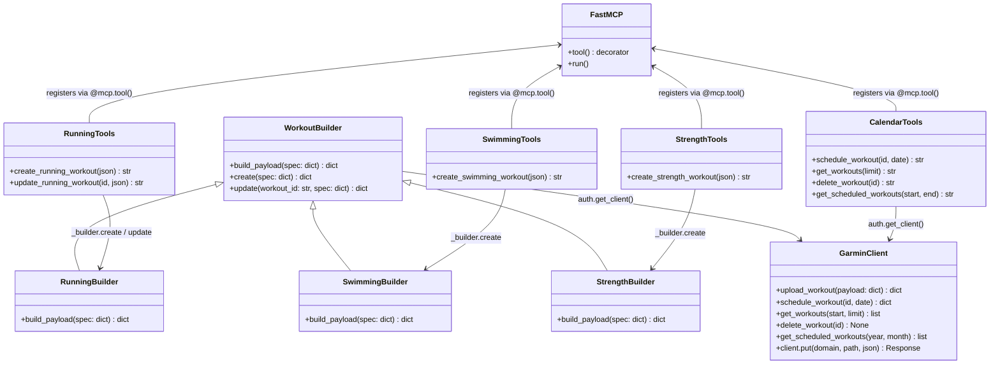

# Architecture — garmin-mcp

## Overview

FastMCP server that exposes Garmin Connect data and workout management to AI agents. Tools are Python functions registered via the `@mcp.tool()` decorator; the framework handles JSON-RPC transport.

---

## Layer diagram

```
┌─────────────────────────────────────────────────────────┐
│                    AI Agent / Claude                     │
└──────────────────────────┬──────────────────────────────┘
                           │  MCP (JSON-RPC over stdio)
┌──────────────────────────▼──────────────────────────────┐
│                  FastMCP  (app.py)                       │
│   @mcp.tool() functions registered at import time        │
├─────────────────────────────────────────────────────────┤
│  tools/                                                  │
│  ├── running.py   swimming.py   strength.py              │  ← workout builders
│  ├── calendar.py                                         │  ← workout CRUD
│  ├── activities.py  health.py  training.py  profile.py  │  ← read-only Garmin data
│  └── plans.py                                            │  ← local file persistence
├─────────────────────────────────────────────────────────┤
│  tools/builder.py  (WorkoutBuilder base + repeat_group)  │
├─────────────────────────────────────────────────────────┤
│  auth.py  (Garmin client singleton)                      │
└──────────────────────────┬──────────────────────────────┘
                           │  HTTPS / garth OAuth
┌──────────────────────────▼──────────────────────────────┐
│              Garmin Connect API                          │
└─────────────────────────────────────────────────────────┘
```

---

## Class diagram



---

## Sequence: create workout

```
Agent → MCP tool (workout_json: str)
         │
         ├─ json.loads(workout_json)   # parse + validate
         │
         ├─ _builder.create(spec)
         │     └─ build_payload(spec)  # sport-specific dict assembly
         │
         └─ GarminClient.upload_workout(payload)  # POST /workout-service/workout
              └─ returns {workoutId, name}
```

## Sequence: update workout

```
Agent → MCP tool (workout_id, workout_json: str)
         │
         ├─ json.loads(workout_json)
         │
         ├─ _builder.update(workout_id, spec)
         │     ├─ build_payload(spec)
         │     ├─ payload["workoutId"] = int(workout_id)
         │     └─ client.client.put(…/workout/{id}, json=payload)  # PUT, preserves scheduling
         │
         └─ returns {workoutId, name, updated: true}
```

---

## Module responsibilities

| File | Responsibility |
|------|---------------|
| `server.py` | Entry point. Imports all tool modules to trigger `@mcp.tool()` registration. |
| `app.py` | FastMCP instance — single shared object across all modules. |
| `auth.py` | `get_client()` singleton — lazily creates and caches the authenticated Garmin client. |
| `utils.py` | `serialize()` — JSON-safe serialization of Garmin API responses. |
| `tools/builder.py` | `WorkoutBuilder` base class + `repeat_group()` shared helper. |
| `tools/running.py` | `RunningBuilder` — pace zone math, distance/time-based step assembly. MCP tools: `create_running_workout`, `update_running_workout`. |
| `tools/swimming.py` | `SwimmingBuilder` — stroke types, pool length, fixed/lap-button rests. MCP tool: `create_swimming_workout`. |
| `tools/strength.py` | `StrengthBuilder` — exercise steps, sets/reps/weight, repeat groups. MCP tool: `create_strength_workout`. |
| `tools/calendar.py` | Sport-agnostic workout CRUD: `schedule_workout`, `get_workouts`, `delete_workout`, `get_scheduled_workouts`. |
| `tools/activities.py` | Activity retrieval and export (GPX, TCX, CSV). |
| `tools/health.py` | Sleep, HRV, body battery, stress, SpO2, heart rate, body composition. |
| `tools/training.py` | Training status, VO2 max, personal records. |
| `tools/plans.py` | `save_plan` — persists agent-generated training plans as JSON to `~/devel/garmin/data/`. |
| `tools/profile.py` | User profile, devices, gear. |

---

## Design patterns

### Template Method — `WorkoutBuilder`

`create()` and `update()` define the algorithm skeleton (parse → build → upload/PUT). Sport-specific subclasses override only `build_payload()` — the part that varies. The upload call, error path, and return format are inherited and never duplicated.

```
WorkoutBuilder.create(spec)
    └── self.build_payload(spec)   ← overridden by each sport
    └── upload_workout(payload)    ← inherited, same for all
```

### Strategy — concrete builders

Each builder is a strategy for assembling a `workoutSegments` payload. Swapping the strategy changes the sport without touching the MCP tool registration or the upload logic.

### Decorator — `@mcp.tool()`

FastMCP discovers tools at import time via the decorator. `server.py` imports all tool modules; the side-effect of each import is tool registration. No explicit registry — the framework owns discovery.

### Singleton — `auth.get_client()`

The Garmin client is created once and cached. OAuth tokens are persisted at `~/.garminconnect/`. All tools call `auth.get_client()` directly — no dependency injection, justified by the single-user, single-account nature of the server.

### Module-level instance — `_builder`

Each sport module instantiates its builder once at module load (`_builder = RunningBuilder()`). MCP tool functions close over this instance. Avoids re-instantiation on every call while keeping the builder stateless (all state lives in `spec`).

---

## Key decisions and trade-offs

### Raw dicts over Pydantic models

**Decision:** All workout payloads are plain Python dicts sent directly to `upload_workout(dict)`.

**Why:** The garminconnect typed helpers (`upload_running_workout`, `upload_swimming_workout`) are thin wrappers that call `upload_workout(model.to_dict())`. Bypassing them removes a serialization indirection, makes the payload directly inspectable in tests, and unifies all sports under one upload path.

**Trade-off:** No Pydantic validation on the way out. A malformed field silently produces a Garmin API 400 error instead of a local `ValidationError`. Acceptable because the builder functions are the single source of truth for field names.

### PUT over delete + recreate

**Decision:** `update_running_workout` issues a `PUT /workout-service/workout/{id}` rather than deleting and recreating.

**Why:** Deleting breaks the workout's calendar scheduling (the `workoutScheduleId` reference becomes orphaned). PUT preserves the ID and all scheduled dates — the agent never needs to reschedule after an edit.

### Flat `tools/` over a `tools/workouts/` subpackage

**Decision:** All tool modules live at the same level in `tools/`.

**Why:** With three sport-specific builders, a subpackage adds structural overhead (extra `__init__.py`, import path changes) without improving navigability. A fourth sport would revisit this — the `WorkoutBuilder` base is already in place to make that migration trivial.

### `calendar.py` name over `workouts.py`

**Decision:** The CRUD module is named `calendar.py`, not `workouts.py`.

**Why:** `schedule_workout`, `get_workouts`, `delete_workout`, `get_scheduled_workouts` operate on the Garmin calendar, not on workout content. `workouts.py` implied ownership of workout creation, which now belongs to `running.py`, `swimming.py`, and `strength.py`. `calendar.py` names the domain correctly.

### Pace zone in m/s, not s/m

**Decision:** `pace.zone` targets use meters-per-second (`targetValueOne`, `targetValueTwo`), where `targetValueOne > targetValueTwo` (faster pace = higher m/s).

**Why:** The Garmin API stores pace zones in m/s regardless of the `min/km` display on the device. The conversion is `1000 / seconds_per_km`. Tolerance is applied before conversion: fast bound = `1000 / (total_sec - tol)`, slow bound = `1000 / (total_sec + tol)`.

---

## Pace math reference

```
pace "4:31" = 271 s/km
tolerance   = ±5 s

fast bound (targetValueOne) = 1000 / (271 - 5) = 1000 / 266 ≈ 3.7594 m/s
slow bound (targetValueTwo) = 1000 / (271 + 5) = 1000 / 276 ≈ 3.6232 m/s

E zone "5:26"–"5:59" (no tolerance, range target):
  fast = 1000 / 326 ≈ 3.0675 m/s
  slow = 1000 / 359 ≈ 2.7855 m/s
```

---

## Running workout spec reference

```
Distance-based (quality sessions):          Time-based (run/walk):
{                                           {
  "name": "Limiar — 3×14' T",               "name": "Run/Walk",
  "warmup_km": 2,                            "warmup_minutes": 5,
  "warmup_pace": ["5:26", "5:59"],           "main_set": [
  "main_set": [{                               {"type": "interval", "minutes": 2},
    "type": "repeat",                          {"type": "recovery", "minutes": 2}
    "repeat": 3,                             ],
    "steps": [                               "repeat": 7,
      {"type": "interval",                   "cooldown_minutes": 5
       "minutes": 14,                       }
       "pace": "4:31"},
      {"type": "recovery", "minutes": 2}
    ]
  }],
  "cooldown_km": 1,
  "cooldown_pace": ["5:26", "5:59"],
  "pace_tolerance_sec": 5
}

Easy / long run:
{"name": "Rodagem — 12 km", "main_km": 12, "main_pace": ["5:26", "5:59"]}
```
