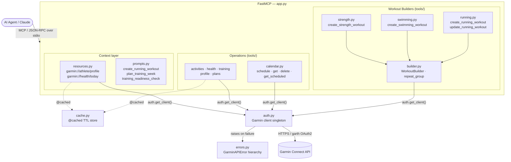
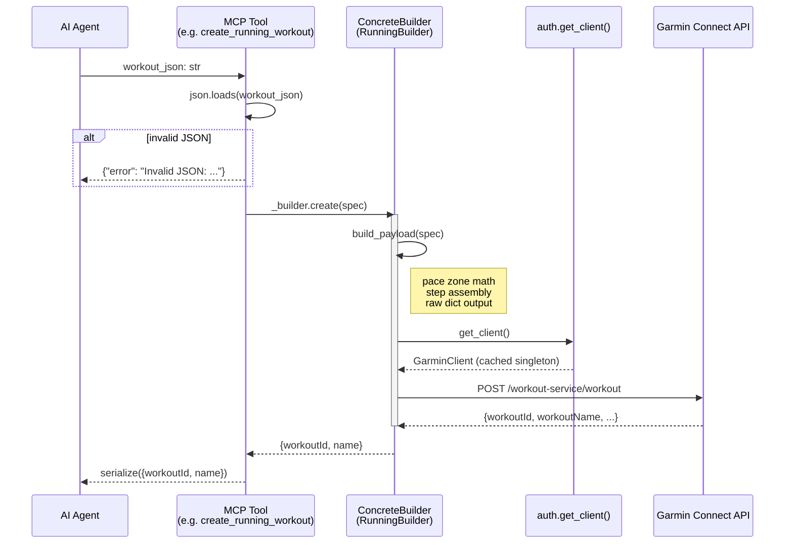
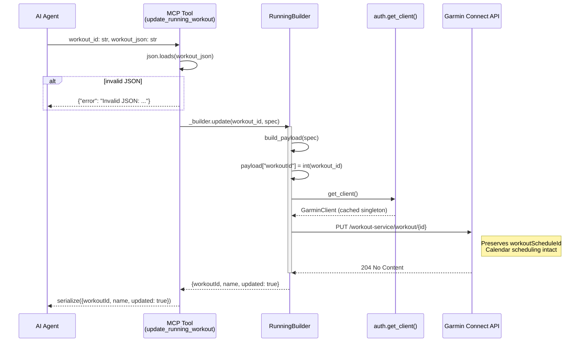
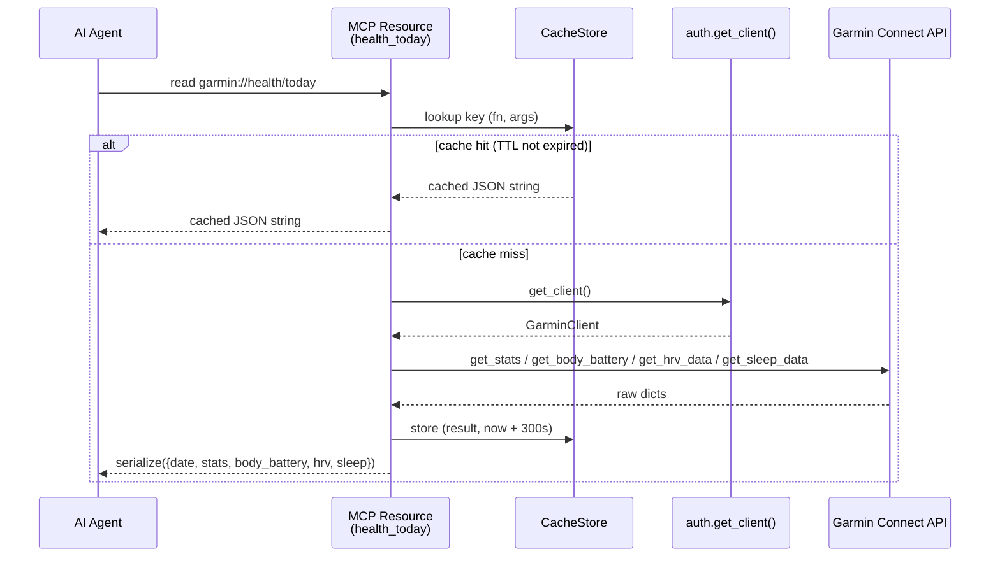

# Architecture — garmin-mcp

## Overview

FastMCP server that exposes Garmin Connect data and workout management to AI agents.
The server registers tools, resources, and prompts via decorator side-effects at import
time. All three are MCP primitives backed by the same `FastMCP` instance.

---

## Layer diagram



---

## Class diagram

```mermaid
classDiagram
    class WorkoutBuilder {
        +build_payload(spec: dict) dict
        +create(spec: dict) dict
        +update(workout_id: str, spec: dict) dict
    }

    class RunningBuilder {
        +build_payload(spec: dict) dict
    }
    class SwimmingBuilder {
        +build_payload(spec: dict) dict
    }
    class StrengthBuilder {
        +build_payload(spec: dict) dict
    }

    WorkoutBuilder <|-- RunningBuilder
    WorkoutBuilder <|-- SwimmingBuilder
    WorkoutBuilder <|-- StrengthBuilder

    class GarminClient {
        +upload_workout(payload: dict) dict
        +schedule_workout(id, date) dict
        +get_workouts(start, limit) list
        +delete_workout(id) None
        +get_scheduled_workouts(year, month) list
        +client.put(domain, path, json) Response
    }

    WorkoutBuilder --> GarminClient : auth.get_client()

    class GarminAPIError {
        <<exception>>
    }
    class GarminAuthError {
        <<exception>>
    }
    class GarminRateLimitError {
        <<exception>>
    }
    class GarminNotFoundError {
        <<exception>>
    }

    GarminAPIError <|-- GarminAuthError
    GarminAPIError <|-- GarminRateLimitError
    GarminAPIError <|-- GarminNotFoundError

    class CacheStore {
        +_store: dict
        +cached(ttl_seconds) decorator
        +invalidate(prefix) None
    }

    class FastMCP {
        +tool() decorator
        +resource() decorator
        +prompt() decorator
        +run()
    }

    class RunningTools {
        +create_running_workout(json) str
        +update_running_workout(id, json) str
    }
    class SwimmingTools {
        +create_swimming_workout(json) str
    }
    class StrengthTools {
        +create_strength_workout(json) str
    }
    class CalendarTools {
        +schedule_workout(id, date) str
        +get_workouts(limit) str
        +delete_workout(id) str
        +get_scheduled_workouts(start, end) str
    }
    class Resources {
        +athlete_profile() str
        +health_today() str
    }
    class Prompts {
        +create_running_workout() str
        +plan_training_week() str
        +training_readiness_check() str
    }

    FastMCP <-- RunningTools : registers via @mcp.tool()
    FastMCP <-- SwimmingTools : registers via @mcp.tool()
    FastMCP <-- StrengthTools : registers via @mcp.tool()
    FastMCP <-- CalendarTools : registers via @mcp.tool()
    FastMCP <-- Resources : registers via @mcp.resource()
    FastMCP <-- Prompts : registers via @mcp.prompt()

    RunningTools --> RunningBuilder : _builder.create / update
    SwimmingTools --> SwimmingBuilder : _builder.create
    StrengthTools --> StrengthBuilder : _builder.create
    CalendarTools --> GarminClient : auth.get_client()

    Resources --> CacheStore : @cached
    Prompts ..> FastMCP : static strings
```



---

## Sequence: create workout



---

## Sequence: update workout



---

## Sequence: read resource (cached)



---

## Module responsibilities

| File | Responsibility |
|------|---------------|
| `server.py` | Entry point. Imports all modules to trigger registration side-effects. |
| `app.py` | FastMCP instance — single shared object across all modules. |
| `auth.py` | `get_client()` singleton — lazily creates and caches the Garmin client. Login failures raise `GarminAuthError`. |
| `cache.py` | `@cached(ttl_seconds)` decorator — in-memory TTL store keyed by `(fn, args, kwargs)`. `invalidate()` for selective or full purge. |
| `errors.py` | `GarminAPIError` hierarchy: `GarminAuthError`, `GarminRateLimitError`, `GarminNotFoundError`. `tool_guard` decorator for consistent JSON error responses. |
| `utils.py` | `serialize()`, `today()`, `export_dir()` — shared stateless helpers. |
| `resources.py` | MCP resources: `garmin://athlete/profile` and `garmin://health/today`. Cached; the agent reads these without invoking a tool. |
| `prompts.py` | MCP prompts: `create_running_workout`, `plan_training_week`, `training_readiness_check`. Static coaching workflow templates. |
| `check.py` | Connectivity smoke test (`make check`) — verifies OAuth tokens and prints account info. |
| `tools/builder.py` | `WorkoutBuilder` base class + `repeat_group()` shared helper. |
| `tools/running.py` | `RunningBuilder` — pace zone math, distance/time-based step assembly. MCP tools: `create_running_workout`, `update_running_workout`. |
| `tools/swimming.py` | `SwimmingBuilder` — stroke types, pool length, fixed/lap-button rests. MCP tool: `create_swimming_workout`. |
| `tools/strength.py` | `StrengthBuilder` — exercise steps, sets/reps/weight, repeat groups. MCP tool: `create_strength_workout`. |
| `tools/calendar.py` | Sport-agnostic workout CRUD: `schedule_workout`, `get_workouts`, `delete_workout`, `get_scheduled_workouts`. |
| `tools/activities.py` | Activity retrieval and export (GPX, TCX, CSV). |
| `tools/health.py` | Sleep, HRV, body battery, stress, SpO2, heart rate, body composition. Responses cached 5 min. |
| `tools/training.py` | Training status, VO2 max, personal records. Responses cached 5–10 min. |
| `tools/plans.py` | `save_plan` — persists agent-generated training plans as JSON to `~/devel/garmin/data/`. |
| `tools/profile.py` | User profile, devices, gear. Responses cached 10 min. |

---

## Design patterns

### Template Method — `WorkoutBuilder`

`create()` and `update()` define the algorithm skeleton (parse → build → upload/PUT). Sport-specific subclasses override only `build_payload()` — the part that varies. The upload call, error path, and return format are inherited and never duplicated.

### Strategy — concrete builders

Each builder is a strategy for assembling a `workoutSegments` payload. Swapping the strategy changes the sport without touching the MCP tool registration or the upload logic.

### Decorator — `@mcp.tool()` / `@mcp.resource()` / `@mcp.prompt()`

FastMCP discovers all three primitive types at import time via decorators. `server.py` imports all modules; the side-effect of each import is registration. No explicit registry — the framework owns discovery.

### Singleton — `auth.get_client()`

The Garmin client is created once and cached. OAuth tokens are persisted at `~/.garminconnect/`. All tools, resources, and prompts call `auth.get_client()` directly — no dependency injection, justified by the single-user, single-account nature of the server.

### Module-level instance — `_builder`

Each sport module instantiates its builder once at module load (`_builder = RunningBuilder()`). MCP tool functions close over this instance. Avoids re-instantiation on every call while keeping the builder stateless (all state lives in `spec`).

### TTL Cache — `@cached`

Read-only tools and resources apply `@cached(ttl_seconds)` to avoid redundant Garmin API calls. The cache is a module-level dict keyed by `(fn.__qualname__, args, kwargs)`. TTL ranges from 300 s (health data) to 600 s (profile, PRs). `cache.invalidate()` is called in test fixtures to prevent cross-test leakage.

### Exception Hierarchy — `GarminAPIError`

`auth.get_client()` and individual API calls raise typed subclasses (`GarminAuthError`, `GarminRateLimitError`, `GarminNotFoundError`) translated from garminconnect exceptions. The `tool_guard` decorator catches these at the tool boundary and serialises them as `{"error": "...", "type": "..."}` — keeping the MCP transport layer clean.

---

## Key decisions and trade-offs

### Raw dicts over Pydantic models

**Decision:** All workout payloads are plain Python dicts sent directly to `upload_workout(dict)`.

**Why:** The garminconnect typed helpers (`upload_running_workout`, `upload_swimming_workout`) are thin wrappers that call `upload_workout(model.to_dict())`. Bypassing them removes a serialization indirection, makes the payload directly inspectable in tests, and unifies all sports under one upload path.

**Trade-off:** No Pydantic validation on the way out. A malformed field silently produces a Garmin API 400 error instead of a local `ValidationError`. Acceptable because the builder functions are the single source of truth for field names.

### PUT over delete + recreate

**Decision:** `update_running_workout` issues a `PUT /workout-service/workout/{id}` rather than deleting and recreating.

**Why:** Deleting breaks the workout's calendar scheduling (the `workoutScheduleId` reference becomes orphaned). PUT preserves the ID and all scheduled dates — the agent never needs to reschedule after an edit.

### Flat `tools/` over a `tools/workouts/` subpackage

**Decision:** All tool modules live at the same level in `tools/`.

**Why:** With three sport-specific builders, a subpackage adds structural overhead without improving navigability. A fourth sport would revisit this — the `WorkoutBuilder` base is already in place to make that migration trivial.

### `calendar.py` name over `workouts.py`

**Decision:** The CRUD module is named `calendar.py`, not `workouts.py`.

**Why:** `schedule_workout`, `get_workouts`, `delete_workout`, `get_scheduled_workouts` operate on the Garmin calendar, not on workout content. `workouts.py` implied ownership of workout creation, which now belongs to the sport-specific builders.

### `resources.py` and `prompts.py` at `src/` root, not in `tools/`

**Decision:** Resources and prompts live alongside `server.py`, not inside `tools/`.

**Why:** Both use `@mcp.resource()` and `@mcp.prompt()` — they register with the same FastMCP instance as tools, making them MCP primitives, not utilities. Moving them to `tools/` would misrepresent their nature; moving them to a `utils/` folder would imply they are stateless helpers, which they are not (both have import-time side-effects).

### In-memory TTL cache over no cache

**Decision:** Read-only tools and resources apply `@cached(ttl_seconds)` with a module-level dict.

**Why:** Garmin rate-limits the Connect API. A coaching agent may call `get_stats`, `get_hrv_data`, and `get_sleep` in rapid succession during a single planning session — all three would otherwise hit the API separately. 300 s TTL covers a full planning conversation without stale data risk.

**Trade-off:** Cache is unbounded and in-process. A long-running server accumulates entries. Acceptable for a single-user personal server; a multi-user deployment would need an eviction strategy.

### Pace zone in m/s, not s/m

**Decision:** `pace.zone` targets use meters-per-second (`targetValueOne`, `targetValueTwo`), where `targetValueOne > targetValueTwo` (faster pace = higher m/s).

**Why:** The Garmin API stores pace zones in m/s regardless of the `min/km` display on the device. Tolerance is applied before conversion: fast bound = `1000 / (total_sec - tol)`, slow bound = `1000 / (total_sec + tol)`.

---

## Pace math reference

```
pace "4:31" = 271 s/km  |  tolerance ±5 s
  fast bound (targetValueOne) = 1000 / 266 ≈ 3.7594 m/s
  slow bound (targetValueTwo) = 1000 / 276 ≈ 3.6232 m/s

E zone "5:26"–"5:59"  (range target, no tolerance)
  fast = 1000 / 326 ≈ 3.0675 m/s
  slow = 1000 / 359 ≈ 2.7855 m/s
```

---

## Running workout spec reference

```
Distance-based (quality sessions):          Time-based (run/walk):
{                                           {
  "name": "Limiar — 3×14' T",               "name": "Run/Walk",
  "warmup_km": 2,                            "warmup_minutes": 5,
  "warmup_pace": ["5:26", "5:59"],           "main_set": [
  "main_set": [{                               {"type": "interval", "minutes": 2},
    "type": "repeat", "repeat": 3,             {"type": "recovery", "minutes": 2}
    "steps": [                               ],
      {"type": "interval",                   "repeat": 7,
       "minutes": 14, "pace": "4:31"},       "cooldown_minutes": 5
      {"type": "recovery", "minutes": 2}    }
    ]
  }],
  "cooldown_km": 1,
  "cooldown_pace": ["5:26", "5:59"],
  "pace_tolerance_sec": 5
}

Easy / long run:
{"name": "Rodagem — 12 km", "main_km": 12, "main_pace": ["5:26", "5:59"]}
```
